<div align="center">


<br />


<br />

<a href="https://github.com/fishman7337"></a>
<a href="https://www.linkedin.com/in/goh-kun-ming-58573430a/"></a>
<a href="mailto:kunmingaden@gmail.com"></a>

<br />

<a href="https://orcid.org/0009-0008-7666-781X"></a>
<a href="https://arxiv.org/abs/2508.09209"></a>

<br />
<br />


<br />


<br />
<br />

<a href="#mission-control">Mission Control</a> ·
<a href="#research-spotlight">Research</a> ·
<a href="#selected-research-and-builds">Builds</a> ·
<a href="#technical-stack">Stack</a> ·
<a href="#github-telemetry">Telemetry</a> ·
<a href="#contact">Contact</a>

</div>

---

## `~/whoami`

```ts
const fishman7337 = {
  name: "Goh Kun Ming",
  handle: "fishman7337",
  base: "Singapore",
  timezone: "Asia/Singapore (SGT, UTC+08:00)",
  education: "Diploma in Applied AI & Analytics, Singapore Polytechnic",
  currentRole: "Applied AI Research Intern",
  publicResearch: "Quantum-Enhanced GANs preprint · arXiv:2508.09209",
  operatingMode: "research → reproducibility → evaluation → deployable systems",
  proofPoints: ["PyTorch", "Keras", "Qiskit", "Pandas/NumPy", "SQL", "AWS", "Docker", "CI/CD"]
};
```

I’m focused on a practical arc: **ask a research question, build a reproducible baseline, measure it honestly, then turn the useful pieces into documented systems.**

The common thread across the work below is **quantum ML, computer vision, geospatial preparation, MLOps, and responsible release discipline**.

---

## Mission Control


<table>
  <tr>
    <td width="25%" valign="top"><h3>🧠 Research</h3><p>Hybrid quantum-classical ML, GAN baselines, reproducible experiments, and evaluation discipline.</p></td>
    <td width="25%" valign="top"><h3>🛰️ Perception</h3><p>Computer vision, satellite imagery preparation, sensor fusion, remote-sensing features, and detection pipelines.</p></td>
    <td width="25%" valign="top"><h3>⚙️ Systems</h3><p>Flask/FastAPI apps, Docker workflows, CI/CD, model serving, tests, security checks, and MLOps docs.</p></td>
    <td width="25%" valign="top"><h3>🛡️ Governance</h3><p>Responsible AI thinking, model cards, data cards, threat models, and accountable release practices.</p></td>
  </tr>
</table>

<details>
<summary><b>🧩 Expand the operating principles</b></summary>

<br />

| Principle | How I apply it |
|---|---|
| **Truth-grounded claims** | I prefer honest baselines, clear limitations, and reproducible evidence over inflated results. |
| **Systems thinking** | A model is only useful when the surrounding data, testing, deployment, monitoring, and docs are coherent. |
| **Research-to-product loop** | I like converting experiments into usable, reviewable, well-documented artifacts. |
| **Safety and governance** | I treat documentation, access control, threat modeling, and risk controls as first-class engineering work. |

</details>

---

## Research Spotlight


<table>
  <tr>
    <td width="62%" valign="top">
      <h3>Quantum-Enhanced Generative Adversarial Networks</h3>
      <p><b>Comparative Analysis of Classical and Hybrid Quantum-Classical Generative Adversarial Networks</b></p>
      <p>
        My arXiv preprint investigates whether parameterised quantum circuits can act as useful latent priors for generative modelling under near-term quantum constraints.
        The work compares a classical GAN against multiple HQCGAN variants and keeps the claims bounded by image-quality metrics and limitations.
      </p>
      <ul>
        <li>Compared a classical GAN against <b>3-, 5-, and 7-qubit</b> HQCGAN variants.</li>
        <li>Used <b>Qiskit's AerSimulator</b> with realistic noise models.</li>
        <li>Focused on <b>binary MNIST digits 0 and 1</b> to align with constrained quantum latent dimensions.</li>
        <li>Ran <b>150-epoch</b> experiments and evaluated image-generation quality with <b>FID</b> and <b>KID</b>.</li>
      </ul>
    </td>
    <td width="38%" valign="middle" align="center">
      <a href="https://arxiv.org/abs/2508.09209"></a>
      <br /><br />
      
      
      
      
      <br /><br />
      <sub>Quantum AI × Generative Modelling × Evaluation Discipline</sub>
    </td>
  </tr>
</table>

<details>
<summary><b>🔬 Open the research mental model</b></summary>

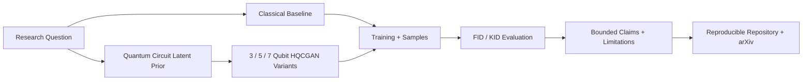

</details>

---

## Selected Research And Builds


### Featured builds

<table>
  <tr>
    <td width="50%" valign="top">
      <h3>🧬 Hybrid Quantum-Classical GAN Research</h3>
      <p>HQCGAN experiments comparing classical GAN baselines with noisy quantum-circuit latent priors on binary MNIST.</p>
      <p><b>Signal stack:</b> Qiskit · TensorFlow · GANs · FID/KID · experiment configs · reproducibility · arXiv.</p>
      <p><a href="https://github.com/fishman7337/hybrid-quantum-classical-gan-research"><b>Open repository</b></a></p>
    </td>
    <td width="50%" valign="top">
      <h3>🛰️ ISR Satellite Imagery Pipeline</h3>
      <p>Satellite imagery preparation, geometry/topology feature engineering, preliminary model screening, and W&B-tracked orchestration.</p>
      <p><b>Signal stack:</b> remote sensing · computer vision · PyTorch · W&B · geospatial features · governance docs.</p>
      <p><a href="https://github.com/fishman7337/ISR"><b>Open repository</b></a></p>
    </td>
  </tr>
  <tr>
    <td width="50%" valign="top">
      <h3>🌐 Global Security Policy Intelligence</h3>
      <p>Historical security analytics, governance/public-policy panels, ML/DL, graph intelligence, RAG safety, and reproducible MLOps.</p>
      <p><b>Signal stack:</b> React · ML · graph analytics · Neo4j · data engineering · RAG guardrails.</p>
      <p><a href="https://github.com/fishman7337/global-security-policy-intelligence"><b>Open repository</b></a></p>
    </td>
    <td width="50%" valign="top">
      <h3>🥬 VeggieAI MLOps Platform</h3>
      <p>Vegetable image classifier with model serving, auth, prediction history, CI/CD, pytest, security checks, Docker, and MLOps docs.</p>
      <p><b>Signal stack:</b> Flask · TensorFlow serving · model registry · CI/CD · security scanning · operational docs.</p>
      <p><a href="https://github.com/fishman7337/sp-daaa-doaa-ca2-vegetable-classification-application"><b>Open repository</b></a></p>
    </td>
  </tr>
</table>

<details>
<summary><b>Open the full project map</b></summary>

<br />

| Arena | Repository | What it demonstrates |
|---|---|---|
| 🧬 Quantum / Generative AI | [`hybrid-quantum-classical-gan-research`](https://github.com/fishman7337/hybrid-quantum-classical-gan-research) | HQCGAN research, noisy quantum circuits, GAN evaluation, reproducible experiments |
| 🛰️ Geospatial / ISR | [`ISR`](https://github.com/fishman7337/ISR) | Satellite imagery preparation, feature engineering, PyTorch screening, W&B orchestration |
| 🌐 Policy Intelligence | [`global-security-policy-intelligence`](https://github.com/fishman7337/global-security-policy-intelligence) | Historical analytics, graph intelligence, RAG safety, governance panels |
| 🥬 MLOps Product | [`sp-daaa-doaa-ca2-vegetable-classification-application`](https://github.com/fishman7337/sp-daaa-doaa-ca2-vegetable-classification-application) | Model serving, CI/CD, security scans, Docker, classification app |
| 🏙️ Multimodal ML App | [`sp-daaa-doaa-ca1-housing-price-ml-application`](https://github.com/fishman7337/sp-daaa-doaa-ca1-housing-price-ml-application) | Tabular + NLP + image signals, Flask, Docker, tests, MLOps docs |
| 🔐 Secure Systems | [`yubikey-secure-endpoint-system`](https://github.com/fishman7337/yubikey-secure-endpoint-system) | Rust endpoint watchdog, security-key checks, audit logging, threat thinking |
| 📈 Math + Regression | [`sp-daaa-mai-ca3-wage-modelling`](https://github.com/fishman7337/sp-daaa-mai-ca3-wage-modelling) | Regression modelling, gradient descent, pytest, LaTeX reporting |
| 💬 NLP / Deep Learning | [`sp-daaa-dele-ca1-movie-review-sentiment-analysis`](https://github.com/fishman7337/sp-daaa-dele-ca1-movie-review-sentiment-analysis) | RNN, LSTM, GRU sentiment/rating prediction workflows |
| 🕹️ Reinforcement Learning | [`sp-daaa-dele-ca2-pendulum-reinforcement-learning`](https://github.com/fishman7337/sp-daaa-dele-ca2-pendulum-reinforcement-learning) | DQN-style experimentation and control-task learning |
| 📊 Visual Analytics | [`sp-daaa-davi-ca1-hdb-price-dashboard`](https://github.com/fishman7337/sp-daaa-davi-ca1-hdb-price-dashboard) | HDB resale analytics, Tableau workbook, cleaning/validation scripts |

</details>

---

## Technical Stack


<div align="center">

<p><b>Clickable stack map - rounded logo cards - no duplicate technologies</b></p>

<p align="center">
<a href="https://www.python.org/">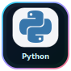</a> <a href="https://pytorch.org/">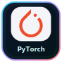</a> <a href="https://www.tensorflow.org/">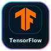</a> <a href="https://keras.io/">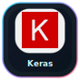</a> <a href="https://scikit-learn.org/">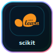</a> <a href="https://jupyter.org/">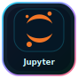</a>
<br />
<a href="https://www.qiskit.org/">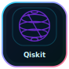</a> <a href="https://pennylane.ai/"></a> <a href="https://opencv.org/">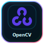</a> <a href="https://www.ros.org/"></a> <a href="https://pandas.pydata.org/"></a> <a href="https://numpy.org/">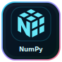</a>
<br />
<a href="https://matplotlib.org/">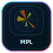</a> <a href="https://seaborn.pydata.org/">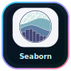</a> <a href="https://www.statsmodels.org/"></a> <a href="https://plotly.com/python/">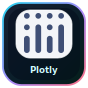</a> <a href="https://dash.plotly.com/"></a> <a href="https://www.tableau.com/"></a>
<br />
<a href="https://powerbi.microsoft.com/">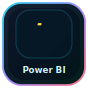</a> <a href="https://developer.mozilla.org/en-US/docs/Web/HTML"></a> <a href="https://developer.mozilla.org/en-US/docs/Web/CSS">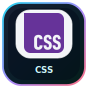</a> <a href="https://developer.mozilla.org/en-US/docs/Web/JavaScript"></a> <a href="https://www.typescriptlang.org/">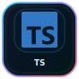</a> <a href="https://react.dev/">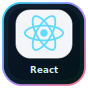</a>
<br />
<a href="https://vuejs.org/"></a> <a href="https://nextjs.org/"></a> <a href="https://nodejs.org/">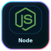</a> <a href="https://vite.dev/">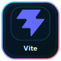</a> <a href="https://tailwindcss.com/">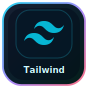</a> <a href="https://www.postgresql.org/"></a>
<br />
<a href="https://www.sqlite.org/"></a> <a href="https://neo4j.com/">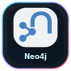</a> <a href="https://aws.amazon.com/"></a> <a href="https://cloud.google.com/"></a> <a href="https://kubernetes.io/">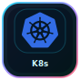</a> <a href="https://www.docker.com/">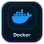</a>
<br />
<a href="https://fastapi.tiangolo.com/">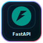</a> <a href="https://flask.palletsprojects.com/">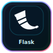</a> <a href="https://github.com/features/actions">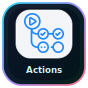</a> <a href="https://docs.pytest.org/">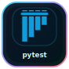</a> <a href="https://wandb.ai/"></a> <a href="https://www.rust-lang.org/">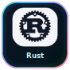</a>
</p>

</div>

<details>
<summary><b>Open the capability matrix</b></summary>

<br />

| Capability | Tools / methods | Portfolio signal |
|---|---|---|
| Machine Learning | Python, PyTorch, TensorFlow, Keras, scikit-learn, Jupyter, evaluation metrics | Classification, regression, GANs, RL, practical ML apps |
| Web + Frontend | HTML5, CSS, JavaScript, TypeScript, React, Vue, Next.js, Node.js, Vite, Tailwind CSS | Dashboards, portfolio UI, public-facing AI tools, interactive app surfaces |
| Data + Statistics | Pandas, NumPy, Matplotlib, Seaborn, statsmodels, SQL | HDB analytics, wage modelling, statistical reports, validation scripts |
| Vision + Robotics | OpenCV, ROS, sensor fusion, satellite imagery, feature engineering | ISR, CV classification, object detection, perception pipelines |
| Quantum AI | Qiskit, PennyLane, AerSimulator, parameterised quantum circuits, NISQ-aware design | HQCGAN research and arXiv preprint |
| Visual Apps + Graphs | Plotly, Dash, Tableau, Power BI, Neo4j, graph analytics | Dashboards, policy intelligence, exploratory analysis, graph-backed insights |
| Systems + Cloud | Flask, FastAPI, Docker, Kubernetes, GitHub Actions, AWS, GCP, pytest | Model serving, CI/CD, security checks, deployable apps |
| Governance + Security | threat models, audit logs, model cards, risk controls, Rust | Responsible AI docs and secure endpoint tooling |

</details>

---

## Roadmap / Build Log


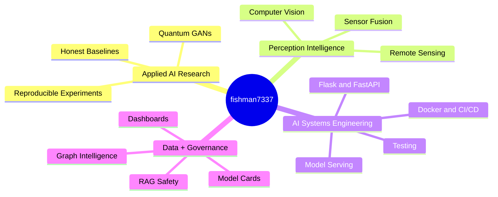

---

## Systems Console


---

## GitHub Telemetry

<div align="center">

<sub>Telemetry timezone: Singapore Time (SGT, UTC+08:00).</sub>
<br /><br />


</div>

<div align="center">
  
</div>

---

## Contact

<div align="center">

<a href="mailto:kunmingaden@gmail.com"></a>
<a href="https://www.linkedin.com/in/goh-kun-ming-58573430a/"></a>
<a href="https://github.com/fishman7337"></a>
<a href="https://arxiv.org/abs/2508.09209"></a>

<br />
<br />


</div>
