

 

 

 

<b>SINGAPORE</b> · APPLIED AI & ANALYTICS · BUILDING IN PUBLIC

 

<a href="#a-studio-for-curious-ideas">Studio</a> ·
<a href="#work-worth-opening">Selected work</a> ·
<a href="#one-experiment-in-depth">Research note</a> ·
<a href="#the-craft-behind-the-code">Craft</a> ·
<a href="#open-source-footprint">Open source</a> ·
<a href="#start-a-conversation">Contact</a>

## A studio for curious ideas

I’m Kun Ming. I enjoy the whole arc of making with machine learning: finding the right question, understanding the data, building a baseline, testing the interesting idea, and shaping the useful part into software people can actually explore.

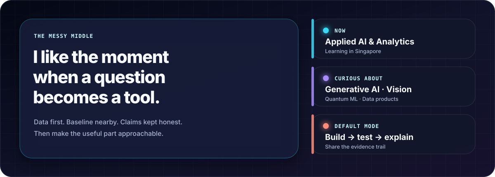

The projects below are less a list of technologies than a record of how I think: **curious about the idea, sceptical about the claim, and serious about the artifact.**

## Work worth opening

Six projects, six different ways to move from a question to something inspectable. Every specimen opens its repository.

<table>
  <tr>
    <td width="50%" valign="top">
      <a href="https://github.com/fishman7337/hybrid-quantum-classical-gan-research">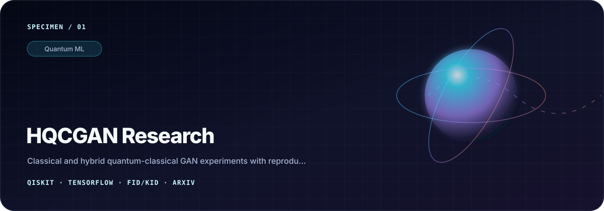</a>
      <h3><a href="https://github.com/fishman7337/hybrid-quantum-classical-gan-research">HQCGAN Research ↗</a></h3>
      
A classical baseline compared with 3-, 5-, and 7-qubit hybrid variants using noisy circuit priors, reproducible configuration, and FID/KID evaluation.

      
<code>Qiskit</code> <code>TensorFlow</code> <code>GANs</code> <code>arXiv</code>

    </td>
    <td width="50%" valign="top">
      <a href="https://github.com/fishman7337/leaf-object-detection">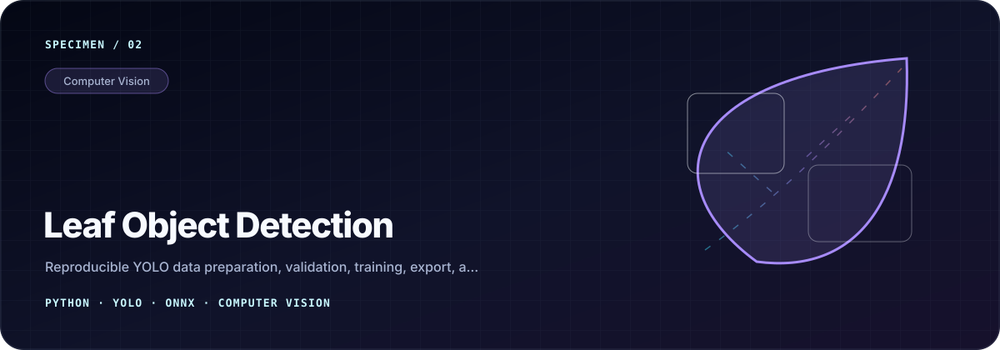</a>
      <h3><a href="https://github.com/fishman7337/leaf-object-detection">Leaf Object Detection ↗</a></h3>
      
A reproducible path from annotation validation and YOLO training to ONNX export and browser inference.

      
<code>Python</code> <code>YOLO</code> <code>ONNX</code> <code>Computer vision</code>

    </td>
  </tr>
  <tr>
    <td width="50%" valign="top">
      <a href="https://github.com/fishman7337/sp-daaa-dsaa-ca1-haiku-generator">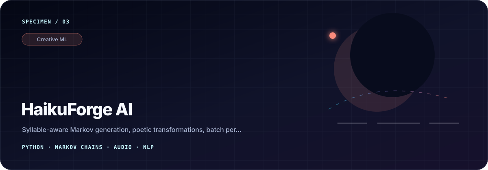</a>
      <h3><a href="https://github.com/fishman7337/sp-daaa-dsaa-ca1-haiku-generator">HaikuForge AI ↗</a></h3>
      
A playful 5–7–5-aware writing lab with Markov generation, poetic transformations, batch variation, and WAV narration.

      
<code>NLP</code> <code>Markov chains</code> <code>Audio</code> <code>Python</code>

    </td>
    <td width="50%" valign="top">
      <a href="https://github.com/fishman7337/sp-daaa-dsaa-ca2-newspaper-restoration">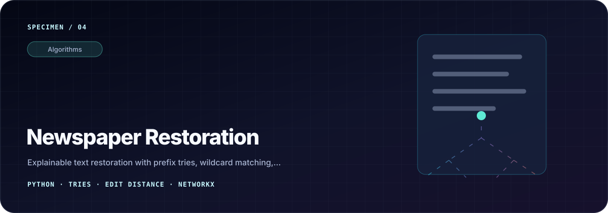</a>
      <h3><a href="https://github.com/fishman7337/sp-daaa-dsaa-ca2-newspaper-restoration">Newspaper Restoration ↗</a></h3>
      
An explainable historical-text toolkit built from prefix tries, wildcard recovery, edit-distance search, and graph visualisation.

      
<code>Tries</code> <code>Algorithms</code> <code>NetworkX</code> <code>pytest</code>

    </td>
  </tr>
  <tr>
    <td width="50%" valign="top">
      <a href="https://github.com/fishman7337/sp-daaa-pai-ca2-gobest-trip-safety-predictor">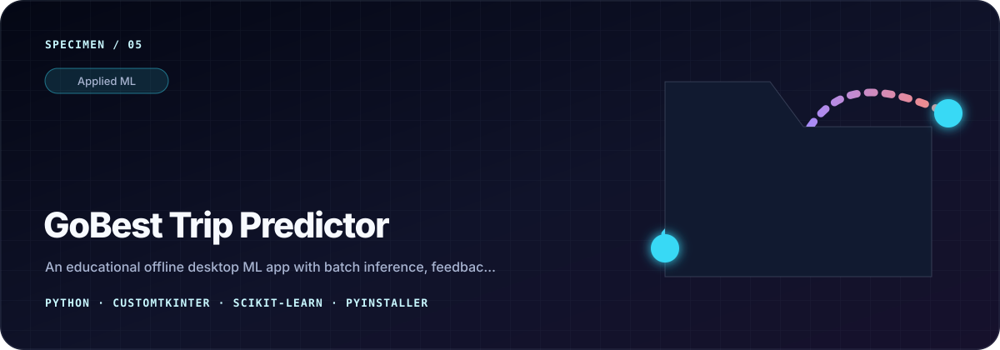</a>
      <h3><a href="https://github.com/fishman7337/sp-daaa-pai-ca2-gobest-trip-safety-predictor">GoBest Trip Predictor ↗</a></h3>
      
An offline desktop ML application with batch inference, feedback capture, lightweight drift checks, and packaged smoke tests.

      
<code>scikit-learn</code> <code>CustomTkinter</code> <code>PyInstaller</code>

    </td>
    <td width="50%" valign="top">
      <a href="https://github.com/fishman7337/sp-daaa-bed-ca-fitnessquest">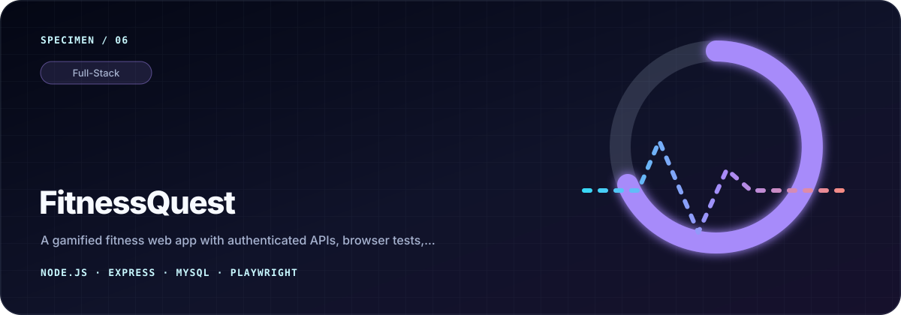</a>
      <h3><a href="https://github.com/fishman7337/sp-daaa-bed-ca-fitnessquest">FitnessQuest ↗</a></h3>
      
A gamified fitness product with authenticated APIs, responsive journeys, regression coverage, and browser automation.

      
<code>Express</code> <code>MySQL</code> <code>JWT</code> <code>Playwright</code>

    </td>
  </tr>
</table>

<b>More from the workbench</b>

 

| Project | The question behind it |
| --- | --- |
| [EstateScope AI](https://github.com/fishman7337/sp-daaa-doaa-ca1-housing-price-ml-application) | How can tabular, text, and image signals meet in one housing-value workflow? |
| [VeggieAI](https://github.com/fishman7337/sp-daaa-doaa-ca2-vegetable-classification-application) | What does it take to move image classification from model to tested application? |
| [Movie Sentiment AI](https://github.com/fishman7337/sp-daaa-dele-ca1-movie-review-sentiment-analysis) | How do recurrent architectures differ on sentiment and rating prediction? |
| [Pendulum Reinforcement Learning](https://github.com/fishman7337/sp-daaa-dele-ca2-pendulum-reinforcement-learning) | How can a control task make reinforcement-learning trade-offs visible? |
| [HDB Price Dashboard](https://github.com/fishman7337/sp-daaa-davi-ca1-hdb-price-dashboard) | How can Singapore resale data become a validated, explorable story? |

## One experiment, in depth

<table>
  <tr>
    <td width="33%" valign="top">
      <h3>The question</h3>
      
Can noisy parameterised quantum circuits serve as useful latent priors for image generation under constrained settings?

    </td>
    <td width="33%" valign="top">
      <h3>The comparison</h3>
      
A classical GAN and 3-, 5-, and 7-qubit hybrid variants on binary MNIST digits 0 and 1, evaluated with FID and KID.

    </td>
    <td width="33%" valign="top">
      <h3>The honest result</h3>
      
The classical baseline led overall. The useful contribution is the reproducible comparison and a bounded account of the hybrid approach.

    </td>
  </tr>
</table>

&nbsp;

## The craft behind the code

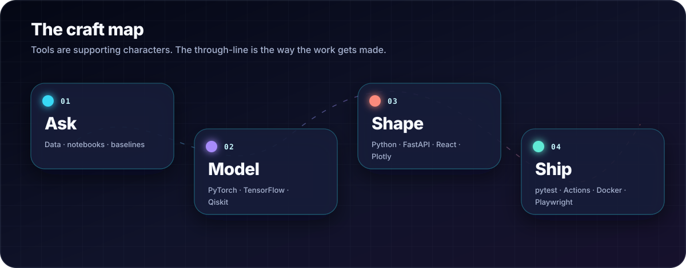

<b>Open the toolbox</b>

 

| Layer | Tools I reach for |
| --- | --- |
| Modelling | `Python` · `PyTorch` · `TensorFlow` · `Keras` · `scikit-learn` · `Qiskit` · `OpenCV` |
| Data + visualisation | `Pandas` · `NumPy` · `SQL` · `Matplotlib` · `Plotly` · `Tableau` |
| Product | `Flask` · `FastAPI` · `Node.js` · `React` · `PostgreSQL` |
| Delivery | `pytest` · `Playwright` · `Ruff` · `Docker` · `GitHub Actions` |

> **Working rule:** complexity has to earn its place. A good project leaves behind the question, baseline, configuration, tests, limitations, and a path for someone else to inspect it.

## Open-source footprint

<picture>
  <source media="(prefers-color-scheme: dark)" srcset="https://raw.githubusercontent.com/fishman7337/fishman7337/output/github-contribution-grid-snake-dark.svg" />
  <source media="(prefers-color-scheme: light)" srcset="https://raw.githubusercontent.com/fishman7337/fishman7337/output/github-contribution-grid-snake.svg" />
  
</picture>

 

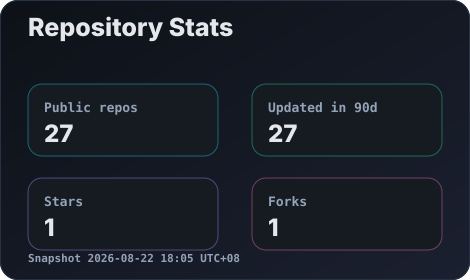
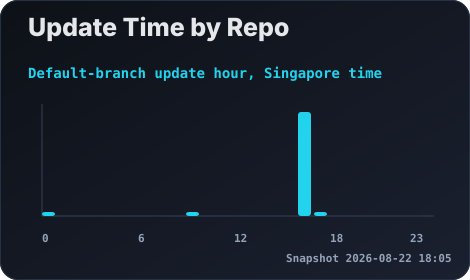

 

Checked-in public metadata snapshot. Descriptive—not a measure of impact.

## Start a conversation

If you’re exploring careful ML experiments, creative computation, computer vision, quantum ML, or ways to turn a model into a better learning product, I’d be glad to compare notes.

  

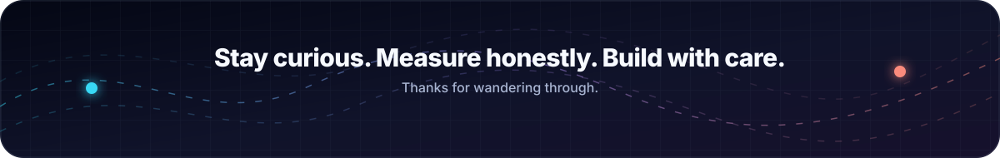

