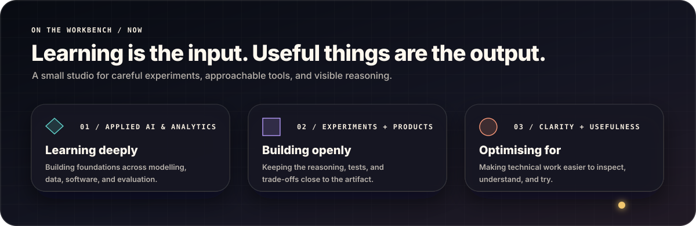
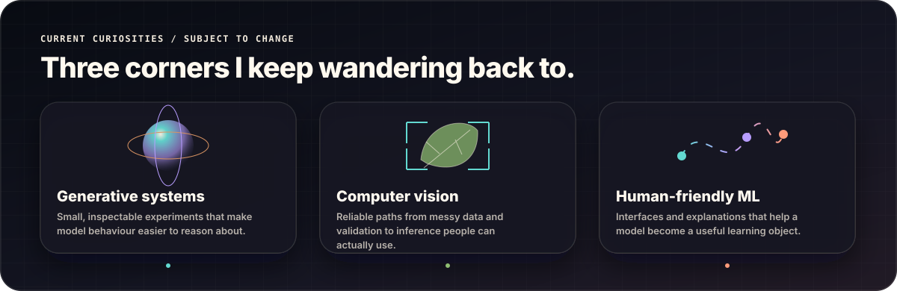

 

  

<b>SINGAPORE</b> · APPLIED AI & ANALYTICS · CURIOUSLY MADE

  

<a href="#welcome-to-the-workshop">Workshop</a> ·
<a href="#the-project-cabinet">Project cabinet</a> ·
<a href="#how-an-idea-leaves-the-workshop">Process</a> ·
<a href="#current-curiosities">Curiosities</a> ·
<a href="#open-source-trail">Open source</a> ·
<a href="#leave-a-note">Contact</a>

## Welcome to the workshop

I’m Kun Ming. I like the full journey from an untidy question to a working artifact: understanding the data, building the unglamorous baseline, testing the interesting idea, and making the result easier for someone else to inspect.

This is less a catalogue of technologies than a record of how I work: **curious about the idea, careful with the claim, and serious about making the result usable.**

## The project cabinet

Each exhibit below is an interactive drawer. Click or tap a title to see the question behind the build, what is inside, and where the code lives.

<b>Drawer 01 · Hybrid Generative Models</b> — comparing two ways to shape a generator

 

> **The question:** What changes when a classical image generator receives a circuit-based latent prior?

I built a reproducible comparison of a classical baseline and several hybrid variants, with shared configuration, controlled evaluation, and documented limits. The most useful part is not a dramatic claim; it is a build that makes the comparison inspectable.

<b>Inside:</b> <code>Qiskit</code> · <code>TensorFlow</code> · <code>GANs</code> · <code>FID / KID</code>

**[Open the repository →](https://github.com/fishman7337/hybrid-quantum-classical-gan-research)**

<b>Drawer 02 · Leaf Object Detection</b> — treating the pipeline as part of the model

 

> **The question:** How do you make the entire detection workflow trustworthy, not just the training run?

The repository connects annotation checks, dataset preparation, YOLO training, evaluation, ONNX export, and browser inference. It is designed so the path from raw labels to a usable detector stays visible.

<b>Inside:</b> <code>Python</code> · <code>YOLO</code> · <code>ONNX</code> · <code>Computer vision</code>

**[Open the repository →](https://github.com/fishman7337/leaf-object-detection)**

<b>Drawer 03 · HaikuForge AI</b> — a small machine for constrained play

 

> **The question:** Can a text generator feel playful while keeping its rules visible?

HaikuForge combines syllable-aware Markov generation, poetic transformations, batch variation, and WAV narration. It is deliberately compact: a creative system whose mechanics are still easy to follow.

<b>Inside:</b> <code>Python</code> · <code>Markov chains</code> · <code>NLP</code> · <code>Audio</code>

**[Open the repository →](https://github.com/fishman7337/sp-daaa-dsaa-ca1-haiku-generator)**

<b>Drawer 04 · Newspaper Restoration</b> — algorithms you can watch reason

 

> **The question:** How can damaged historical text be restored through explainable search structures?

This toolkit brings together prefix tries, wildcard recovery, edit-distance search, and graph visualisation. Rather than hiding the answer behind a black box, it exposes the structures used to reach it.

<b>Inside:</b> <code>Tries</code> · <code>Edit distance</code> · <code>NetworkX</code> · <code>pytest</code>

**[Open the repository →](https://github.com/fishman7337/sp-daaa-dsaa-ca2-newspaper-restoration)**

<b>Drawer 05 · GoBest Trip Predictor</b> — moving a model onto the desktop

 

> **The question:** What does it take to package a prediction workflow for reliable offline use?

GoBest wraps a model in an educational desktop application with batch inference, feedback capture, lightweight drift checks, packaging, and smoke tests—the less glamorous pieces that make a model feel like software.

<b>Inside:</b> <code>scikit-learn</code> · <code>CustomTkinter</code> · <code>PyInstaller</code>

**[Open the repository →](https://github.com/fishman7337/sp-daaa-pai-ca2-gobest-trip-safety-predictor)**

<b>Drawer 06 · FitnessQuest</b> — product engineering with a playful loop

 

> **The question:** How can a fitness journey become engaging without hiding the engineering underneath?

FitnessQuest is a gamified web application with authenticated APIs, a relational data layer, responsive journeys, regression coverage, and automated browser flows.

<b>Inside:</b> <code>Node.js</code> · <code>Express</code> · <code>MySQL</code> · <code>Playwright</code>

**[Open the repository →](https://github.com/fishman7337/sp-daaa-bed-ca-fitnessquest)**

<b>Open the back room</b> — five more builds and the question behind each

 

| Build | The question behind it |
| --- | --- |
| [EstateScope AI](https://github.com/fishman7337/sp-daaa-doaa-ca1-housing-price-ml-application) | How can tabular, text, and image signals meet in one housing-value workflow? |
| [VeggieAI](https://github.com/fishman7337/sp-daaa-doaa-ca2-vegetable-classification-application) | What does it take to move image classification from model to tested application? |
| [Movie Sentiment AI](https://github.com/fishman7337/sp-daaa-dele-ca1-movie-review-sentiment-analysis) | How do recurrent architectures differ on sentiment and rating prediction? |
| [Pendulum Reinforcement Learning](https://github.com/fishman7337/sp-daaa-dele-ca2-pendulum-reinforcement-learning) | How can a control task make reinforcement-learning trade-offs visible? |
| [HDB Price Dashboard](https://github.com/fishman7337/sp-daaa-davi-ca1-hdb-price-dashboard) | How can Singapore resale data become a validated, explorable story? |

## How an idea leaves the workshop

The sequence is simple on purpose. It keeps me honest about what stage a project has actually reached—and prevents an interesting model from being mistaken for a finished product.

> **Workshop rule:** complexity has to earn its place. A good build leaves behind the question, baseline, configuration, tests, limitations, and a path for someone else to try it.

## Current curiosities

<b>Open the toolbox</b> — the tools are supporting actors, not the plot

 

| Layer | Tools I reach for |
| --- | --- |
| Modelling | <code>Python</code> · <code>PyTorch</code> · <code>TensorFlow</code> · <code>Keras</code> · <code>scikit-learn</code> · <code>Qiskit</code> · <code>OpenCV</code> |
| Data + visualisation | <code>Pandas</code> · <code>NumPy</code> · <code>SQL</code> · <code>Matplotlib</code> · <code>Plotly</code> · <code>Tableau</code> |
| Product | <code>Flask</code> · <code>FastAPI</code> · <code>Node.js</code> · <code>React</code> · <code>PostgreSQL</code> |
| Delivery | <code>pytest</code> · <code>Playwright</code> · <code>Ruff</code> · <code>Docker</code> · <code>GitHub Actions</code> |

## Open-source trail

<picture>
  <source media="(prefers-color-scheme: dark)" srcset="https://raw.githubusercontent.com/fishman7337/fishman7337/output/github-contribution-grid-snake-dark.svg" />
  <source media="(prefers-color-scheme: light)" srcset="https://raw.githubusercontent.com/fishman7337/fishman7337/output/github-contribution-grid-snake.svg" />
  
</picture>

 

 

Checked-in public metadata snapshot. Descriptive—not a measure of impact.

## Leave a note

If you are exploring careful ML experiments, creative computation, computer vision, or ways to turn a model into a friendlier product, I’d be glad to compare notes.

  

