<picture>
  <source media="(max-width: 600px)" srcset="./assets/spatial-hero-mobile.svg" />
  
</picture>

  <a href="https://github.com/fishman7337"><b>GitHub</b></a>
  &nbsp;·&nbsp;
  <a href="https://www.linkedin.com/in/gohkunming/"><b>LinkedIn</b></a>
  &nbsp;·&nbsp;
  <a href="mailto:kunmingaden@gmail.com"><b>Email</b></a>
  &nbsp;·&nbsp;
  <a href="https://github.com/fishman7337?tab=repositories"><b>All projects</b></a>

<b>AI systems · Data products · Full-stack delivery · Responsible engineering</b>

## About me

I’m **Goh Kun Ming**, a Year 3 student in the **Diploma in Applied AI & Analytics at Singapore Polytechnic**, based in Singapore. I am developing toward the kind of AI practitioner who can move between research questions, data, models, software systems, and the people who eventually have to understand or use what was built.

My technical experience spans **data engineering and analysis, machine learning, deep learning, model evaluation, computer vision, conversational and retrieval-based AI, full-stack development, and cloud delivery**. I enjoy working across those boundaries because the most interesting problems rarely stop at a notebook: they continue into data contracts, APIs, interfaces, testing, deployment, monitoring, documentation, and governance.

My research interests include **intelligent systems, AI safety and governance, quantum computing, and complexity science**. Across those areas, I keep returning to the same questions: Is the problem framed well? Is the evidence trustworthy? Can the system explain where its answer came from? Does it remain useful outside the happy path? Can someone else inspect, reproduce, and improve it?

Longer term, I hope to contribute to **AI academia** while continuing to build applied systems. Teaching and mentoring matter to that direction: I want to become good not only at developing technical ideas, but also at making them understandable to other people.

### A quick read

- **Based in:** Singapore
- **Studying:** Year 3, Diploma in Applied AI & Analytics at Singapore Polytechnic
- **Technical range:** data pipelines → analytics → ML/DL → RAG → APIs → interfaces → testing and delivery
- **Research interests:** intelligent systems · responsible AI · quantum computing · complexity science
- **Working style:** evidence-led, systems-minded, documentation-conscious, and curious about first principles
- **Long-term direction:** AI research, academia, teaching, and mentoring

> **The short version:** I do not want the model to be the whole story. I want the question, data, decisions, interface, tests, limitations, and handover to be visible too.

## How I approach a problem

1. **Start with the decision, not the algorithm.** I first ask who needs the result, what they need to decide, and what a useful answer would look like.
2. **Treat data quality as part of the model.** Provenance, missingness, leakage, definitions, and validation matter before architecture selection.
3. **Build a baseline before adding complexity.** A sophisticated system should earn its additional moving parts through evidence.
4. **Connect the whole path.** I think about how ingestion, modelling, retrieval, APIs, interfaces, roles, and deployment affect one another.
5. **Design for failure as well as success.** Robustness, uncertainty, access control, fallbacks, and limitations deserve explicit treatment.
6. **Leave an inspectable trail.** Tests, documentation, evaluation artifacts, and handover notes make the work easier to trust and extend.

## What I bring to a team

<picture>
  <source media="(max-width: 600px)" srcset="./assets/capability-map-mobile.svg" />
  
</picture>

<b>AI systems & evaluation</b> — models with visible assumptions and evidence

 

Machine learning, deep learning, computer vision, NLP, RAG, forecasting, reinforcement learning, and bounded quantum-ML experiments. I care about baselines, split discipline, reproducible configuration, fit-for-purpose metrics, model cards, and honest limitations.

<code>Python</code> · <code>PyTorch</code> · <code>TensorFlow</code> · <code>Keras</code> · <code>scikit-learn</code> · <code>Qiskit</code> · <code>OpenCV</code>

<b>Data intelligence</b> — turning messy evidence into useful decisions

 

Data cleaning, ETL, relational modelling, exploratory analysis, statistical reasoning, clustering, forecasting, geospatial work, and decision-support dashboards. I aim to preserve provenance and define what every metric actually means.

<code>Pandas</code> · <code>NumPy</code> · <code>SQL</code> · <code>PySpark</code> · <code>Plotly</code> · <code>Tableau</code> · <code>Power BI</code>

<b>Product engineering</b> — moving from notebook to a usable system

 

API design, authentication and roles, retrieval pipelines, database-backed workflows, responsive interfaces, and deployment-ready documentation. The goal is an understandable product journey—not a model wrapped in a thin demo.

<code>FastAPI</code> · <code>Flask</code> · <code>React</code> · <code>Next.js</code> · <code>Node.js</code> · <code>PostgreSQL</code> · <code>Supabase</code>

<b>Quality & delivery</b> — proof around the product

 

Unit, API, integration, security, and browser-flow testing; Docker; continuous delivery; documentation; data contracts; and model/data governance. I treat reproducibility and handover as product features.

<code>pytest</code> · <code>Playwright</code> · <code>Docker</code> · <code>GitHub Actions</code> · <code>AWS</code>

## What teammates can expect from me

- **A research-and-systems perspective.** I like understanding why an approach should work, then following it through the architecture needed to make it useful.
- **Questions before assumptions.** I try to make the target, constraints, evaluation criteria, and failure modes explicit before optimising a solution.
- **Visible trade-offs.** I would rather document a limitation or uncertain result than hide it behind polished presentation.
- **Attention to the less glamorous layers.** Data cleaning, access rules, tests, deployment notes, and maintenance documentation are part of the build.
- **Communication as an engineering skill.** I use diagrams, model cards, data contracts, examples, and structured documentation to make technical decisions easier to review.
- **Curiosity beyond one speciality.** My work moves across algorithms, analytics, ML, deep learning, language systems, vision, web products, cloud services, and emerging computation.

## Experience in practice

My recent experience has given me practice at three different scales: an institutional AI product, a multi-role data and workflow platform, and an early-stage recommendation concept. Together they strengthened my ability to move between research, engineering, product questions, and verification.

These are concise highlights from my [public LinkedIn experience](https://www.linkedin.com/in/gohkunming/details/experience/). The numbers describe documented build scope and verification—not business-impact claims.

<b>AI & Data Solutions Researcher · Singapore Polytechnic</b> — Mar 2026, part-time

 

Applied AI and systems analysis for a multi-role operational platform spanning **32 routes, 4 roles, and 11 workflow domains**.

- Designed a Supabase architecture with **39 tables, 30 migrations, 175 row-level security policies, and 5 serverless functions**.
- Added three assisted workflows and a conversational assistant grounded in **14 documents and one institutional website**.
- Built a verification layer of **238 tests, 31 browser end-to-end scenarios, and four continuous-delivery workflows**.

<b>Student Developer · Singapore Polytechnic</b> — Sep 2025 to Mar 2026

 

Built an institutional RAG application using hybrid retrieval, query reformulation, reciprocal-rank fusion, reranking, metadata constraints, and hallucination grading.

- Integrated Claude 3 Haiku and Cohere embeddings through Amazon Bedrock with pgvector and BM25.
- Delivered **53 FastAPI endpoints, seven Next.js pages, and an architecture spanning 27 AWS services**.
- Documented **312 pytest definitions across 72 files**, 11 browser scenarios, and a 30-page deployment and maintenance guide.

<b>Co-Founder, Data & Intelligent Systems · Wagglo SG</b> — Feb to Mar 2026

 

Led the data design for a pet-owner matching concept, from market research to an evidence-gated recommendation framework.

- Designed a Top-K compatibility system using **nine weighted dimensions** and **eight behavioural event types**.
- Analysed **104 survey responses into 102 clean records** to shape product priorities and product-risk decisions.

## Selected work

The projects below are public, inspectable, and chosen to show range: research experiments, data products, and end-to-end AI applications.

### 01 / Models & perception

**How can model experimentation stay reproducible from configuration to evaluation?**

<b>Hybrid Generative Models</b> — classical and circuit-based latent priors

 

A controlled comparison of a classical GAN with 3-, 5-, and 7-qubit hybrid latent-prior variants, supported by PSD-safe FID/KID utilities and **21 tests**.

<code>Qiskit</code> · <code>TensorFlow</code> · <code>GANs</code> · <code>FID / KID</code>

**[Explore the experiment →](https://github.com/fishman7337/hybrid-quantum-classical-gan-research)**

<b>Leaf Object Detection</b> — preparation, validation, export, browser inference

 

A single-class YOLO pipeline with a recorded **57,164-image / 63,225-box** preparation run, ONNX export, a browser demo, and **12 tests**.

<code>Python</code> · <code>YOLO</code> · <code>ONNX</code> · <code>TensorFlow.js</code>

**[Inspect the pipeline →](https://github.com/fishman7337/leaf-object-detection)**

### 02 / Data & decisions

**How does a large dataset become a decision someone can understand?**

<b>HDB Price Dashboard</b> — Singapore resale data as an explorable story

 

Resale analytics over **202,461 canonical cleaned records**, plus a **216,695-row location-enriched table**, with geospatial work, visual explanation, and reproducibility checks.

<code>Python</code> · <code>Tableau</code> · <code>Geospatial data</code> · <code>Data cleaning</code>

**[Explore the analysis →](https://github.com/fishman7337/sp-daaa-davi-ca1-hdb-price-dashboard)**

<b>Student Risk Analytics</b> — transparent rules for intervention support

 

A reusable Dash application for latest-semester GPA and attendance analysis, designed around clear segmentation logic and covered by **eight automated tests**.

<code>Dash</code> · <code>Plotly</code> · <code>Pandas</code> · <code>pytest</code>

**[Open the dashboard repository →](https://github.com/fishman7337/sp-daaa-davi-ca2-student-performance-dashboard)**

### 03 / AI products & delivery

**What turns an AI prototype into a system another person can actually use?**

<b>VeggieAI</b> — image classification as a governed application

 

A split Flask and model-service produce platform with authentication, prediction history, deployment tooling, **217 backend tests, 22 model tests**, and coverage gates.

<code>Flask</code> · <code>TensorFlow</code> · <code>SQLite</code> · <code>Docker</code>

**[Explore the application →](https://github.com/fishman7337/sp-daaa-doaa-ca2-vegetable-classification-application)**

<b>EstateScope AI</b> — multimodal property-price modelling

 

A tested Flask prototype that brings structured, language, and image modelling into one property-value workflow, with explicit held-out evaluation and deployment documentation.

<code>Flask</code> · <code>scikit-learn</code> · <code>NLP</code> · <code>CNN</code>

**[Inspect the system →](https://github.com/fishman7337/sp-daaa-doaa-ca1-housing-price-ml-application)**

<b>More public work</b> — language, forecasting, clustering, full-stack, and packaged ML

 

- [Energy Consumption Forecast](https://github.com/fishman7337/sp-daaa-aiml-ca2-energy-consumption-forecast) — ARIMA/SARIMAX forecasting with continuity validation and 43 tests.
- [HaikuForge AI](https://github.com/fishman7337/sp-daaa-dsaa-ca1-haiku-generator) — constrained Markov generation with WAV narration.
- [Newspaper Restoration](https://github.com/fishman7337/sp-daaa-dsaa-ca2-newspaper-restoration) — tries, wildcard recovery, edit-distance search, and graph visualisation.
- [Customer Clustering & Interpretation](https://github.com/fishman7337/sp-daaa-aiml-ca2-customer-clustering-and-interpretation) — K-Means, agglomerative clustering, and DBSCAN.
- [GoBest Trip Predictor](https://github.com/fishman7337/sp-daaa-pai-ca2-gobest-trip-safety-predictor) — offline batch inference, packaging, and smoke testing.
- [FitnessQuest](https://github.com/fishman7337/sp-daaa-bed-ca-fitnessquest) — authenticated APIs and responsive browser journeys.

## Learning and research direction

My recent learning has been deliberately broader than a single model family. I am building a foundation for studying AI as both a **technical system** and a **human responsibility**.

- **Responsible AI and governance:** fairness, accountability, transparency, privacy, safety, data governance, and responsible decision-making.
- **Deep learning:** neural-network fundamentals, optimisation, evaluation, multi-input and multi-output architectures, embeddings, and practical model development.
- **Quantum computing:** qubits, superposition, entanglement, quantum gates and circuits, Qiskit, and the relationship between classical and quantum approaches.
- **Complex systems:** emergence, resilience, networks, tipping points, agent-based modelling, and how interconnected systems behave under change.
- **Research communication:** explaining assumptions, methods, evidence, limitations, and implications in a form that technical and non-technical readers can follow.

Selected public credentials:

- **Quantum Computing For Everyone — An Introduction**, Fractal, Jul 2026
- **Ethical AI — AI Essentials For Everyone**, University of Cambridge, Jun 2026
- **Introduction to Complexity Science**, Nanyang Technological University Singapore, Jun 2026
- **Advanced Deep Learning with Keras**, DataCamp, Mar 2026
- **Fundamentals of Deep Learning**, NVIDIA, Feb 2026

**[View the public credential record →](https://www.linkedin.com/in/gohkunming/details/certifications/)**

## A real 3D artifact

This is not a mock-up. The shape is generated from a parametric **(2, 3) torus-knot tube**: **1,728 vertices and 3,456 triangular faces**. It represents how I prefer to work—question, data, baseline, experiment, product, and sharing are distinct strands, but the useful artifact is one continuous system.

  <a href="./assets/models/curiosity-knot.stl"><b>Open the interactive 3D viewer</b></a>
  &nbsp;·&nbsp;
  <a href="./assets/models/curiosity-knot.obj"><b>Download the OBJ model</b></a>
  &nbsp;·&nbsp;
  <a href="./scripts/build_3d_mesh.py"><b>Read the generator</b></a>

## How I work

I like ambitious ideas, but I trust them more when the path is explicit:

**Question → data → baseline → experiment → product → evidence → handover**

### Problems I want to keep exploring

- How can retrieval and conversational AI remain grounded, useful, and honest about uncertainty?
- How should evaluation change when an AI system includes data pipelines, retrieval, interfaces, and human decisions—not only a model?
- How can multimodal systems combine structured data, language, images, and sensor-like signals without losing interpretability?
- Where can quantum or hybrid methods be compared with classical baselines in a bounded, reproducible way?
- How can technical tools also become better learning objects for students, practitioners, and decision-makers?

### The environments where I contribute best

I am most interested in work where the problem is not fully solved by choosing a model: the data needs structure, the system crosses multiple layers, reliability matters, and the final result must be communicated clearly. That includes applied AI, data products, research engineering, evaluation, responsible-AI work, and technically grounded experimentation.

<b>How the claims on this profile are grounded</b>

 

The profile deliberately separates documented build scope from measured outcomes. Project claims come from public repository documentation; experience and credential claims come from the public LinkedIn record. No awards, rankings, endorsements, or performance claims are inferred.

**[Read the evidence notes →](./docs/TRUTH_GROUNDING.md)**

## Let’s compare notes

If you are evaluating my work for a role, exploring a collaboration, or simply working on careful AI systems, I would be glad to talk.

  <a href="mailto:kunmingaden@gmail.com"><b>Email me</b></a>
  &nbsp;·&nbsp;
  <a href="https://www.linkedin.com/in/gohkunming/"><b>Connect on LinkedIn</b></a>
  &nbsp;·&nbsp;
  <a href="https://github.com/fishman7337?tab=repositories"><b>Browse every repository</b></a>

<picture>
  <source media="(max-width: 600px)" srcset="./assets/spatial-footer-mobile.svg" />
  
</picture>

Curious by default. Clear by design.

