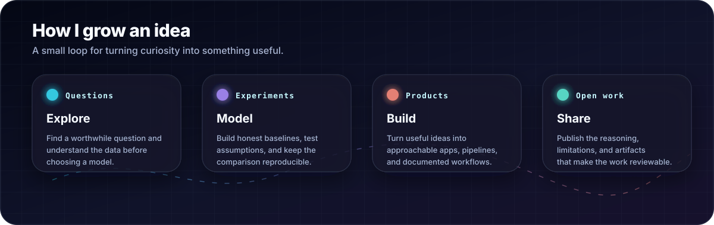
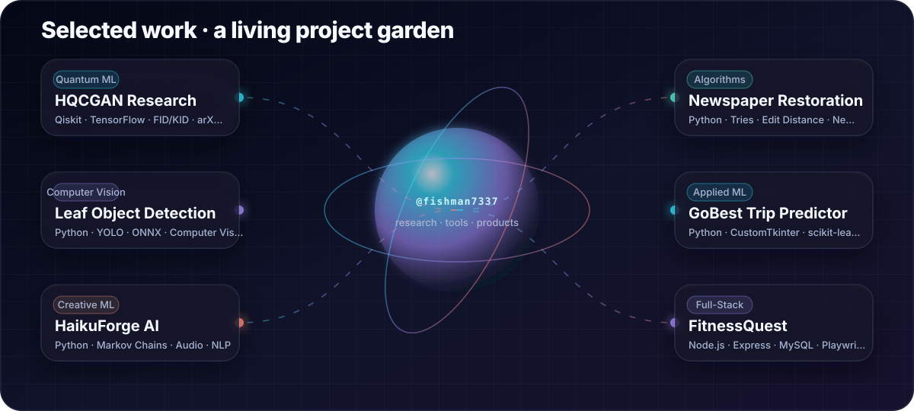
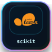
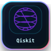
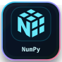
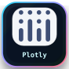
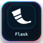
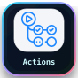
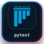
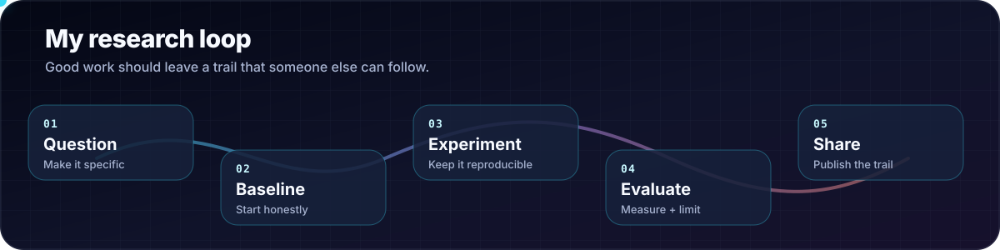

 

 

  

<a href="#what-im-growing">What I’m growing</a> ·
<a href="#selected-work">Selected work</a> ·
<a href="#research-spotlight">Research</a> ·
<a href="#tool-garden">Tools</a> ·
<a href="#how-i-work">Process</a> ·
<a href="#say-hello">Contact</a>

---

## Hello

I’m Kun Ming, an Applied AI & Analytics student in Singapore. I like the whole path from an interesting question to a working artifact: understanding the data, establishing a baseline, experimenting carefully, and turning the useful parts into something other people can inspect and use.

> My favourite projects sit where rigorous experiments meet playful, approachable software.

## What I’m growing

## Selected work

<table>
  <tr>
    <td width="50%" valign="top">
      <h3>🫧 <a href="https://github.com/fishman7337/hybrid-quantum-classical-gan-research">HQCGAN Research</a></h3>
      
Classical and hybrid quantum-classical GAN experiments with noisy circuit priors, FID/KID evaluation, tests, and a public preprint.

      
<code>Qiskit</code> <code>TensorFlow</code> <code>GANs</code> <code>arXiv</code>

    </td>
    <td width="50%" valign="top">
      <h3>🍃 <a href="https://github.com/fishman7337/leaf-object-detection">Leaf Object Detection</a></h3>
      
A reproducible YOLO pipeline for data preparation, annotation validation, training, ONNX export, and browser inference.

      
<code>Python</code> <code>YOLO</code> <code>ONNX</code> <code>CV</code>

    </td>
  </tr>
  <tr>
    <td width="50%" valign="top">
      <h3>🌙 <a href="https://github.com/fishman7337/sp-daaa-dsaa-ca1-haiku-generator">HaikuForge AI</a></h3>
      
A 5–7–5-aware haiku lab with Markov generation, poetic transformations, batch permutations, and WAV narration.

      
<code>NLP</code> <code>Markov chains</code> <code>Audio</code> <code>Python</code>

    </td>
    <td width="50%" valign="top">
      <h3>📰 <a href="https://github.com/fishman7337/sp-daaa-dsaa-ca2-newspaper-restoration">Newspaper Restoration</a></h3>
      
An explainable historical-text toolkit using prefix tries, wildcard restoration, edit-distance search, and graph visualisation.

      
<code>Tries</code> <code>Algorithms</code> <code>NetworkX</code> <code>pytest</code>

    </td>
  </tr>
  <tr>
    <td width="50%" valign="top">
      <h3>🚕 <a href="https://github.com/fishman7337/sp-daaa-pai-ca2-gobest-trip-safety-predictor">GoBest Trip Predictor</a></h3>
      
An educational offline desktop ML app with batch inference, feedback collection, lightweight drift checks, and packaged smoke tests.

      
<code>CustomTkinter</code> <code>scikit-learn</code> <code>PyInstaller</code>

    </td>
    <td width="50%" valign="top">
      <h3>🏃 <a href="https://github.com/fishman7337/sp-daaa-bed-ca-fitnessquest">FitnessQuest</a></h3>
      
A gamified fitness web app with authenticated APIs, responsive flows, security regression tests, and browser automation.

      
<code>Express</code> <code>MySQL</code> <code>JWT</code> <code>Playwright</code>

    </td>
  </tr>
</table>

<b>Open a few more builds</b>

 

| Project | What it explores |
| --- | --- |
| [EstateScope AI](https://github.com/fishman7337/sp-daaa-doaa-ca1-housing-price-ml-application) | Housing-value modelling across tabular, text, and image signals |
| [VeggieAI](https://github.com/fishman7337/sp-daaa-doaa-ca2-vegetable-classification-application) | Image classification, model serving, CI, Docker, and application workflows |
| [Movie Sentiment AI](https://github.com/fishman7337/sp-daaa-dele-ca1-movie-review-sentiment-analysis) | SimpleRNN, LSTM, and GRU workflows for sentiment and rating prediction |
| [Pendulum Reinforcement Learning](https://github.com/fishman7337/sp-daaa-dele-ca2-pendulum-reinforcement-learning) | Control-task experimentation with DQN-style learning |
| [HDB Price Dashboard](https://github.com/fishman7337/sp-daaa-davi-ca1-hdb-price-dashboard) | Singapore resale-price cleaning, analysis, validation, and dashboards |

## Research spotlight

<table>
  <tr>
    <td width="64%" valign="top">
      <h3>Quantum-Enhanced Generative Adversarial Networks</h3>
      
My public preprint compares a classical GAN with 3-, 5-, and 7-qubit hybrid variants that use parameterised quantum circuits as latent priors.

      <ul>
        <li>Binary MNIST digits 0 and 1 under constrained latent dimensions.</li>
        <li>Qiskit AerSimulator with realistic noise models.</li>
        <li>FID and KID for image-quality evaluation.</li>
        <li>Reproducibility helpers, configuration, tests, and explicit limitations.</li>
      </ul>
      
The classical baseline led overall; the value of the study is the comparison, the reproducible trail, and a bounded look at what near-term hybrid approaches can and cannot do.

    </td>
    <td width="36%" valign="middle" align="center">
      
        
      
      
      
    </td>
  </tr>
</table>

## Tool garden

<b>AI + ML</b>

<b>Data + product</b>

<b>Delivery + quality</b>

## How I work

- **Start with the question.** The model comes after the problem and the data are understood.
- **Keep a baseline nearby.** Complexity has to earn its place.
- **Make the path reproducible.** Configs, tests, seeds, and docs are part of the artifact.
- **Report limits with the result.** A useful claim includes its boundary.
- **Turn experiments into tools.** The best ideas become something inspectable and approachable.

## Contribution garden

<picture>
  <source media="(prefers-color-scheme: dark)" srcset="https://raw.githubusercontent.com/fishman7337/fishman7337/output/github-contribution-grid-snake-dark.svg" />
  <source media="(prefers-color-scheme: light)" srcset="https://raw.githubusercontent.com/fishman7337/fishman7337/output/github-contribution-grid-snake.svg" />
  
</picture>

 

 

Telemetry is a checked-in snapshot generated from public GitHub metadata; it is descriptive, not a measure of impact.

## Say hello

I’m always happy to talk about careful ML experiments, creative computing, reproducibility, and building better learning projects.

  

