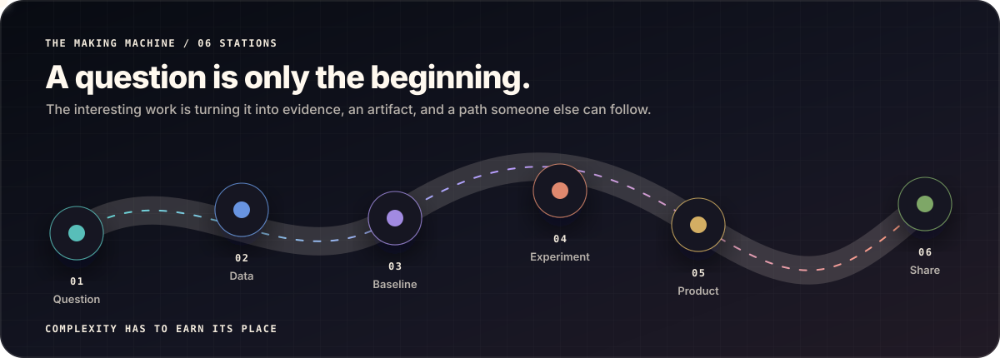

<picture>
  <source media="(max-width: 600px)" srcset="./assets/hero-curiosity-workshop-mobile.svg" />
  
</picture>

  <a href="https://github.com/fishman7337"><b>GitHub</b></a>
  &nbsp;·&nbsp;
  <a href="https://www.linkedin.com/in/gohkunming/"><b>LinkedIn</b></a>
  &nbsp;·&nbsp;
  <a href="mailto:kunmingaden@gmail.com"><b>Email</b></a>

## Hello — I’m Kun Ming.

I build machine-learning systems that are easier to **inspect, test, and use**. I enjoy the complete journey: finding the useful question, understanding the data, building the honest baseline, testing the interesting idea, and turning the result into software someone else can explore.

Right now I’m studying **Applied AI & Analytics in Singapore** and building across generative systems, computer vision, algorithms, data products, and product engineering.

## Six builds. Six questions.

<picture>
  
</picture>

The visual is the index. Open any drawer for the question, the build, and the code.

<b>01 · Hybrid Generative Models</b>

 

**Question:** What changes when a classical image generator receives a circuit-based latent prior?

A reproducible comparison of a classical baseline and several hybrid variants, with shared configuration, controlled evaluation, and documented limits.

<code>Qiskit</code> · <code>TensorFlow</code> · <code>GANs</code> · <code>FID / KID</code>

**[Open repository →](https://github.com/fishman7337/hybrid-quantum-classical-gan-research)**

<b>02 · Leaf Object Detection</b>

 

**Question:** How do you make the entire detection workflow trustworthy, not just the training run?

Annotation checks, dataset preparation, YOLO training, evaluation, ONNX export, and browser inference connected in one reproducible path.

<code>Python</code> · <code>YOLO</code> · <code>ONNX</code> · <code>Computer vision</code>

**[Open repository →](https://github.com/fishman7337/leaf-object-detection)**

<b>03 · HaikuForge AI</b>

 

**Question:** Can a constrained text generator feel playful while keeping its rules visible?

A compact creative system combining syllable-aware Markov generation, poetic transformations, batch variation, and WAV narration.

<code>Python</code> · <code>Markov chains</code> · <code>NLP</code> · <code>Audio</code>

**[Open repository →](https://github.com/fishman7337/sp-daaa-dsaa-ca1-haiku-generator)**

<b>04 · Newspaper Restoration</b>

 

**Question:** How can damaged historical text be restored through explainable search structures?

A restoration toolkit built from prefix tries, wildcard recovery, edit-distance search, and graph visualisation.

<code>Tries</code> · <code>Edit distance</code> · <code>NetworkX</code> · <code>pytest</code>

**[Open repository →](https://github.com/fishman7337/sp-daaa-dsaa-ca2-newspaper-restoration)**

<b>05 · GoBest Trip Predictor</b>

 

**Question:** What does it take to package a prediction workflow for reliable offline use?

A desktop ML application with batch inference, feedback capture, lightweight drift checks, packaging, and smoke tests.

<code>scikit-learn</code> · <code>CustomTkinter</code> · <code>PyInstaller</code>

**[Open repository →](https://github.com/fishman7337/sp-daaa-pai-ca2-gobest-trip-safety-predictor)**

<b>06 · FitnessQuest</b>

 

**Question:** How can a fitness journey become engaging without hiding the engineering underneath?

A gamified web application with authenticated APIs, a relational data layer, responsive journeys, and automated browser flows.

<code>Node.js</code> · <code>Express</code> · <code>MySQL</code> · <code>Playwright</code>

**[Open repository →](https://github.com/fishman7337/sp-daaa-bed-ca-fitnessquest)**

<b>More experiments</b>

 

- [EstateScope AI](https://github.com/fishman7337/sp-daaa-doaa-ca1-housing-price-ml-application) — multimodal housing-value modelling.
- [VeggieAI](https://github.com/fishman7337/sp-daaa-doaa-ca2-vegetable-classification-application) — image classification as a tested application.
- [Movie Sentiment AI](https://github.com/fishman7337/sp-daaa-dele-ca1-movie-review-sentiment-analysis) — recurrent architectures for sentiment and ratings.
- [Pendulum Reinforcement Learning](https://github.com/fishman7337/sp-daaa-dele-ca2-pendulum-reinforcement-learning) — visible control and learning trade-offs.
- [HDB Price Dashboard](https://github.com/fishman7337/sp-daaa-davi-ca1-hdb-price-dashboard) — Singapore resale data as an explorable story.

## How I turn curiosity into software

The stages are intentionally ordinary. They stop an interesting model from being mistaken for a finished product.

> **Working rule:** complexity has to earn its place. A good build leaves behind the question, baseline, configuration, tests, limitations, and a path for someone else to try it.

## What I keep coming back to

- **Generative systems** — small, inspectable experiments that make model behaviour easier to reason about.
- **Computer vision** — reliable paths from messy data and validation to inference people can actually use.
- **Human-friendly ML** — interfaces and explanations that turn models into useful learning objects.

<b>Toolbox</b>

 

- **Modelling:** <code>Python</code> · <code>PyTorch</code> · <code>TensorFlow</code> · <code>Keras</code> · <code>scikit-learn</code> · <code>Qiskit</code> · <code>OpenCV</code>
- **Data:** <code>Pandas</code> · <code>NumPy</code> · <code>SQL</code> · <code>Matplotlib</code> · <code>Plotly</code> · <code>Tableau</code>
- **Product:** <code>Flask</code> · <code>FastAPI</code> · <code>Node.js</code> · <code>React</code> · <code>PostgreSQL</code>
- **Delivery:** <code>pytest</code> · <code>Playwright</code> · <code>Ruff</code> · <code>Docker</code> · <code>GitHub Actions</code>

## Open work, clearly explained

I prefer repositories that preserve the reasoning—not just the final screenshot. That means reproducible setup, tests, limitations, and enough context for another person to inspect the work.

**[Browse all repositories →](https://github.com/fishman7337?tab=repositories)**

## Say hello

If you are exploring careful ML experiments, creative computation, computer vision, or better ways to turn a model into a useful product, I’d be glad to compare notes.

  <a href="mailto:kunmingaden@gmail.com"><b>Email</b></a>
  &nbsp;·&nbsp;
  <a href="https://www.linkedin.com/in/gohkunming/"><b>LinkedIn</b></a>
  &nbsp;·&nbsp;
  <a href="https://github.com/fishman7337"><b>GitHub</b></a>

<picture>
  <source media="(max-width: 600px)" srcset="./assets/workshop-footer-mobile.svg" />
  
</picture>
